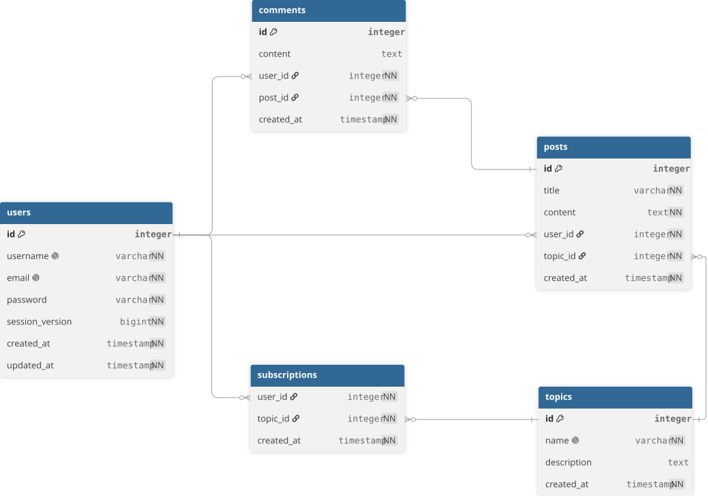

# Définition des données

**Projet :** MDD, Monde Du Dev  
**Version :** MVP option B  
**Dernière mise à jour :** 30/08/2026

## 1. Source et gestion du schéma

Le schéma relationnel est géré par Flyway. Les migrations versionnées dans `back/src/main/resources/db/migration/` ont les rôles suivants :

- `V1__create_schema.sql` crée les tables et les contraintes ;
- `V2__seed_demo_user.sql` ajoute le compte de démonstration local ;
- `V3__seed_topics.sql` initialise le catalogue de thèmes.

## 2. Modèle relationnel

| Table | Données principales | Relations et contraintes |
|---|---|---|
| `users` | `id`, `username`, `email`, `password`, `session_version`, dates de création et mise à jour | `username` et `email` uniques, mot de passe obligatoire. |
| `topics` | `id`, `name`, `description`, `created_at` | Nom unique. |
| `subscriptions` | `user_id`, `topic_id`, `created_at` | Table d'association entre un utilisateur et un thème, unicité du couple utilisateur-thème. |
| `posts` | `id`, `title`, `content`, `user_id`, `topic_id`, `created_at` | Chaque article possède un auteur et un thème obligatoires. |
| `comments` | `id`, `content`, `user_id`, `post_id`, `created_at` | Chaque commentaire est lié à un auteur et à un article. |

Les clés étrangères empêchent la création d'un article, commentaire ou abonnement sans utilisateur, thème ou article existant.

## 3. Formats d'échange

L'API échange du JSON sous `/api`. Les détails des schémas de requête, réponse, validation et erreurs sont fournis par Swagger UI. Les ressources exposées correspondent aux comptes, thèmes, abonnements, articles et commentaires. Les entités de persistance ne sont pas exposées directement : l'API utilise des DTO.

Les dates sont produites côté serveur. Le client ne fournit ni auteur ni date lors de la création d'un article ou d'un commentaire. L'utilisateur courant est identifié par la session authentifiée.

## 4. Données personnelles et protection

Les données personnelles minimales sont le nom d'utilisateur, l'adresse e-mail et le mot de passe. Le mot de passe n'est pas conservé en clair : seul son hachage BCrypt est stocké. Le cookie d'authentification est `HttpOnly` et le secret de signature JWT n'est pas versionné.

Les données de démonstration sont limitées au compte local `demo` et au catalogue de thèmes. Les mots de passe de base de données, le secret JWT et la configuration locale sont placés dans `back/.env`, créé à partir de `.env.example` et ignoré par Git.

## 5. Accès, intégrité et limites du MVP

Les routes métier nécessitent une session valide. Les opérations d'abonnement, de mise à jour du profil, de création d'article et de commentaire sont protégées contre les requêtes intersites par CSRF. Les contrôles d'autorisation s'appuient sur l'utilisateur authentifié, et les erreurs HTTP sont centralisées afin de ne pas divulguer d'informations sensibles.

Le MVP ne prévoit ni suppression de compte, ni politique de rétention, ni export de données personnelles. Ces sujets doivent être définis avant une mise en production réelle afin de répondre aux obligations applicables de protection des données.

Les mesures décrites dans cette annexe montrent que la sécurité et la confidentialité ont été prises en compte : données limitées au besoin fonctionnel, mot de passe haché, secret hors du dépôt, cookie d'authentification non accessible au JavaScript, protection CSRF et erreurs ne révélant pas de donnée sensible.
