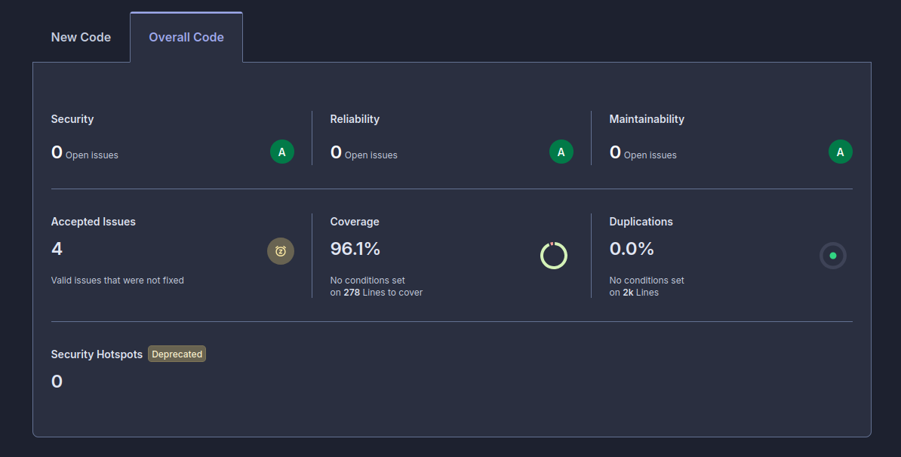
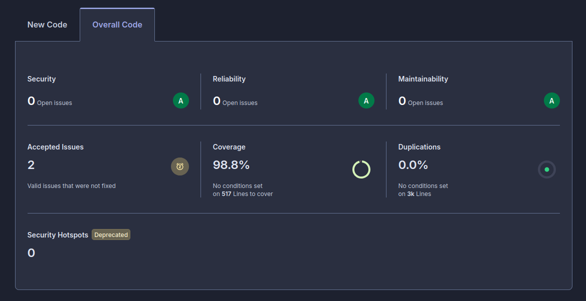

# Rapport de tests et de couverture

## 1. Périmètre et exécutions

Ce rapport présente les contrôles relancés le 30 août 2026 sur la version finale du code. Les rapports de couverture détaillés, générés et versionnés dans le dépôt, sont accessibles depuis l'[index des rapports](../reports/coverage/index.html).

| Domaine | Commande | Résultat |
|---|---|---|
| Backend | `cd back && ./mvnw clean verify` | 86 tests réussis : 52 unitaires et 34 d'intégration. |
| Frontend, tests Vitest | `cd front && npm run test:coverage` | 129 tests réussis : 81 unitaires et 48 d'intégration. |
| Frontend, tests end-to-end | `cd front && npm run e2e:coverage` | 3 spécifications Cypress et 22 scénarios exécutés. |
| API | `npm run bruno:test` | 16 requêtes isolées et 27 assertions réussies. |
| Analyse statique | `cd back && node scripts/run-sonar-scan.mjs` puis `cd front && npm run sonar` | Analyses SonarQube Cloud relancées pour les deux projets. |

Les tests d'intégration backend utilisent une base MySQL Testcontainers isolée. Les vérifications Bruno démarrent également une API et une base de données isolées : elles ne modifient donc pas les données d'un environnement de développement local.

## 2. Stratégie de test

La stratégie associe plusieurs niveaux complémentaires :

- tests unitaires des règles métier, validations, services, composants et utilitaires ;
- tests d'intégration backend avec Spring Boot, MockMvc et MySQL Testcontainers ;
- tests d'intégration frontend avec Vitest, Angular TestBed et le client HTTP de test ;
- scénarios end-to-end Cypress couvrant les parcours principaux dans le navigateur ;
- contrôles API Bruno couvrant le contrat HTTP, l'authentification par cookie et la protection CSRF.

Les tests vérifient notamment l'inscription et la connexion, la restauration de session, la protection des routes, les abonnements aux thèmes, la création et la consultation d'articles, les commentaires, la mise à jour du profil, ainsi que les cas d'erreur et de validation.

## 3. Résultats de couverture

### Backend Java, JaCoCo

Le rapport combiné des tests unitaires et d'intégration atteint les résultats suivants :

| Indicateur | Couverture |
|---|---:|
| Instructions | 99,67 % |
| Branches | 94,12 % |
| Lignes | 99,61 % |
| Complexité | 97,20 % |
| Méthodes | 99,42 % |
| Classes | 100 % |

Le seuil JaCoCo configuré dans la construction est de 80 % pour ces indicateurs. Il est respecté. Les tests d'intégration représentent 34 des 86 tests backend, soit 39,53 %, au-dessus du minimum configuré de 30 %.

Le [rapport JaCoCo combiné](../reports/coverage/back-jacoco/index.html) permet d'accéder aux rapports séparés des tests unitaires et d'intégration.

### Frontend Angular, Vitest

| Indicateur | Couverture |
|---|---:|
| Instructions | 97,03 % |
| Branches | 93,71 % |
| Fonctions | 100 % |
| Lignes | 95,88 % |

Les 48 tests d'intégration représentent 37,21 % des 129 tests Vitest, au-dessus du minimum configuré de 30 %. Le détail est disponible dans le [rapport Vitest combiné](../reports/coverage/front-vitest/index.html).

### Frontend Angular, Cypress

La couverture issue des scénarios end-to-end est distincte de celle de Vitest : elle mesure le code réellement exécuté dans le navigateur.

| Indicateur | Couverture |
|---|---:|
| Instructions | 94,66 % |
| Branches | 94,61 % |
| Fonctions | 97,63 % |
| Lignes | 94,44 % |

Le détail est disponible dans le [rapport Cypress](../reports/coverage/front-e2e/index.html).

## 4. Contrôles complémentaires

Le contrôle `verify` applique aussi Spotless pour vérifier le formatage Java. Le frontend utilise ESLint et Prettier. Les deux analyses SonarQube Cloud complètent ces contrôles par une analyse statique de la sécurité, de la fiabilité, de la maintenabilité, de la duplication et de la couverture.

Les analyses finales ne signalent aucune issue ouverte dans les catégories sécurité, fiabilité et maintenabilité. Elles relèvent également une duplication de 0 %.

*Figure 1 - Analyse SonarQube Cloud du frontend, 29 août 2026.*

*Figure 2 - Analyse SonarQube Cloud du backend, 29 août 2026.*

Les commandes de lancement et les prérequis associés sont documentés dans le [README du dépôt](../../README.md), le [README backend](../../back/README.md), le [README frontend](../../front/README.md) et le [README Bruno](../../bruno/README.md).

## 5. Limites d'interprétation

La couverture mesure l'exécution du code, pas à elle seule la pertinence de tous les scénarios. Les résultats sont donc lus avec les tests fonctionnels, les contrôles d'API, la revue technique et les vérifications manuelles responsive. Les parcours de production, la charge importante et les intégrations externes restent des sujets à traiter avant une mise en production à grande échelle.
